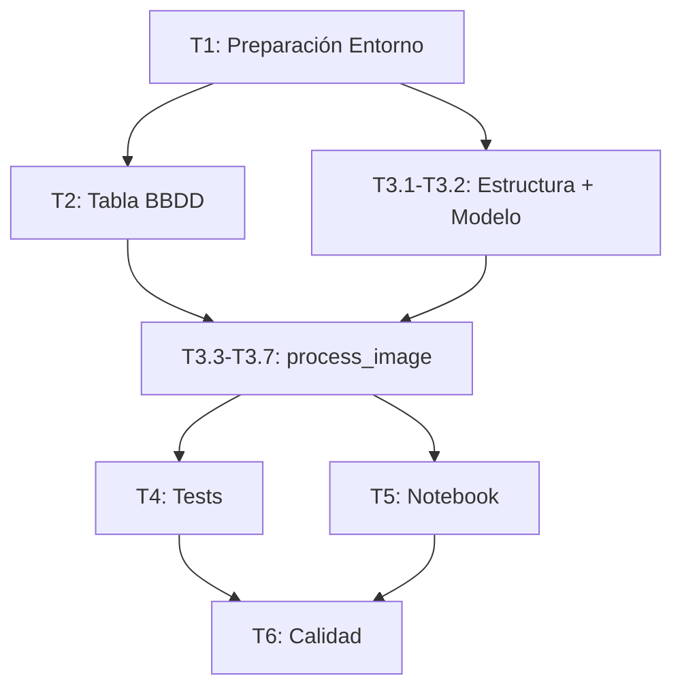

# Plan de Desarrollo: Segmentación SAM 3

> **PRD de referencia:** [`request/segmentacion_rfdetr.md`](file:///c:/proxectos/puzzscan/request/segmentacion_rfdetr.md)
> **Fecha:** 2026-05-16

---

## Resumen

Implementar el pipeline de segmentación de piezas de puzzle con SAM 3 (zero-shot, prompt `"puzzle piece"`) como alternativa paralela al pipeline OpenCV existente. Sin entrenamiento. Sin dataset. Sin alterar código existente.

---

## Tareas

### T1: Preparación del Entorno
**Objetivo:** Instalar todas las dependencias necesarias y preparar la configuración.

- [ ] **T1.1** Instalar dependencias de producción:
  ```bash
  uv add sam3 torch Pillow matplotlib scikit-learn
  ```
  > **Nota:** `sam3` se instala vía pip/uv desde el repo de GitHub si no está en PyPI:
  > `uv add "sam3 @ git+https://github.com/facebookresearch/sam3.git"`
- [ ] **T1.2** Instalar dependencias de desarrollo:
  ```bash
  uv add --dev pytest
  ```
- [ ] **T1.3** Crear archivo `.env.example` con las variables del módulo:
  ```env
  SAM3_CONFIDENCE_THRESHOLD=0.5
  SAM3_TEXT_PROMPT=puzzle piece
  ```
- [ ] **T1.4** Añadir las variables `SAM3_*` al `.env` local (no se commitea).
- [ ] **T1.5** Verificar que los imports funcionan:
  ```bash
  uv run python -c "from sam3 import build_sam3_image_model; print('OK')"
  ```
  Esto descargará el checkpoint de HuggingFace la primera vez.

**Criterio de aceptación:** `uv run python -c "import sam3"` se ejecuta sin error.

---

### T2: Crear la Tabla `sam3_piezas` en la Base de Datos
**Objetivo:** Extender el esquema de BBDD sin tocar la tabla `piezas` existente.

- [ ] **T2.1** Crear la función `init_sam3_db()` que ejecute `CREATE TABLE IF NOT EXISTS sam3_piezas (...)`.
  - Ubicación: puede añadirse a `src/db.py` como función independiente o en un nuevo `src/sam3_db.py`.
  - **No modificar** la función `init_db()` existente ni la tabla `piezas`.
- [ ] **T2.2** Esquema de la tabla (copiar del PRD):

  ```sql
  CREATE TABLE IF NOT EXISTS sam3_piezas (
      id INTEGER PRIMARY KEY AUTOINCREMENT,
      nombre_puzzle TEXT NOT NULL,
      origen TEXT NOT NULL,
      piece_index INTEGER NOT NULL,
      ruta_imagen TEXT NOT NULL,
      contour_json TEXT NOT NULL,
      bounding_box_json TEXT NOT NULL,
      confidence_score REAL NOT NULL,
      area_pixels INTEGER NOT NULL,
      posicion_original TEXT NOT NULL,
      text_prompt TEXT NOT NULL,
      debug_image_path TEXT,
      estado TEXT DEFAULT 'AVAILABLE',
      fecha_creacion TIMESTAMP DEFAULT CURRENT_TIMESTAMP
  );
  ```

- [ ] **T2.3** Crear función `clear_sam3_origen(nombre_puzzle: str, origen: str)` para borrar registros previos (idempotencia).
- [ ] **T2.4** Crear función `insert_sam3_pieza(...)` para insertar un registro nuevo. Debe retornar el `id` asignado.

**Criterio de aceptación:** `init_sam3_db()` crea la tabla. `clear_sam3_origen()` borra registros. `insert_sam3_pieza()` inserta y retorna el ID. La tabla `piezas` no ha sido alterada.

---

### T3: Implementar el Módulo `src/sam3_extractor.py`
**Objetivo:** Crear el pipeline completo de segmentación SAM 3.

#### T3.1: Estructura base del módulo
- [ ] Crear `src/sam3_extractor.py`.
- [ ] Imports necesarios (obtenidos del notebook oficial `references/sam3_image_predictor_example.ipynb`):
  ```python
  import os
  import numpy as np
  import torch
  import cv2
  from PIL import Image
  from pathlib import Path

  import sam3
  from sam3 import build_sam3_image_model
  from sam3.model.sam3_image_processor import Sam3Processor
  from sam3.visualization_utils import plot_results

  from utils.logger import logger
  ```
- [ ] Cargar variables de entorno con `python-dotenv`:
  - `SAM3_CONFIDENCE_THRESHOLD` (float, default: 0.5).
  - `SAM3_TEXT_PROMPT` (str, default: `"puzzle piece"`).

#### T3.2: Inicialización del modelo SAM 3
- [ ] Implementar una función que (basada en el notebook oficial):
  1. Active mixed precision para GPUs Ampere+:
     ```python
     torch.backends.cuda.matmul.allow_tf32 = True
     torch.backends.cudnn.allow_tf32 = True
     torch.autocast("cuda", dtype=torch.bfloat16).__enter__()
     ```
  2. Resuelva la ruta al vocabulario BPE (necesario para text prompts):
     ```python
     sam3_root = os.path.join(os.path.dirname(sam3.__file__), "..")
     bpe_path = f"{sam3_root}/assets/bpe_simple_vocab_16e6.txt.gz"
     ```
  3. Construya el modelo con la ruta BPE:
     ```python
     model = build_sam3_image_model(bpe_path=bpe_path)
     ```
  4. **No** instanciar `Sam3Processor` aquí — se instancia en `process_image` porque `confidence_threshold` puede variar.
  5. Log: `logger.info("SAM 3 model loaded successfully")`.
- [ ] El modelo debe cargarse **una sola vez** y reutilizarse para todas las imágenes del lote.

#### T3.3: Función `process_image(filepath_str: str)`
- [ ] Firma idéntica al pipeline OpenCV para que sean intercambiables.
- [ ] Flujo interno (basado en el patrón del notebook oficial):

  ```
  1. Derivar nombre_puzzle y origen del filepath (Path.parent.name, Path.stem)
  2. Log: logger.info(f"Processing {nombre_puzzle}/{origen} with SAM 3")
  3. Idempotencia: clear_sam3_origen(nombre_puzzle, origen)
  4. Crear directorio de salida: output/{nombre_puzzle}/piezas_sam3/{origen}/
  5. Abrir imagen con PIL: image = Image.open(filepath_str)
  6. Crear procesador e imagen:
     a. processor = Sam3Processor(model, confidence_threshold=threshold)
     b. inference_state = processor.set_image(image)
  7. Ejecutar inferencia con texto:
     a. processor.reset_all_prompts(inference_state)
     b. inference_state = processor.set_text_prompt(
            state=inference_state, prompt=text_prompt
        )
  8. Extraer resultados:
     a. masks = inference_state["masks"]         # (N, 1, H, W) tensor
     b. boxes = inference_state["boxes"]         # (N, 4) tensor [x0,y0,x1,y1]
     c. scores = inference_state["scores"]       # (N,) tensor
     d. mask_logits = inference_state["masks_logits"]  # logits sin umbralizar
  9. N = len(scores). Si N == 0 → logger.warning → return
  10. Para cada pieza i (0..N-1):
      a. Extraer máscara binaria: mask_i = masks[i, 0].cpu().numpy().astype(np.uint8)
      b. Calcular contorno con cv2.findContours sobre mask_i
      c. Extraer bounding box: boxes[i].cpu().tolist() → [x0, y0, x1, y1]
      d. Calcular centro (posicion_original) desde el centroide de la máscara
      e. Calcular area_pixels = int(mask_i.sum())
      f. Recortar pieza con Alpha (aplicar máscara como canal Alpha)
      g. Insertar en BBDD → obtener pieza_id
      h. Guardar PNG: output/{puzzle}/piezas_sam3/{origen}/pieza_{id}.png
      i. Actualizar ruta_imagen en BBDD
  11. Generar imagen de debug:
      - Opción A: usar plot_results(image, inference_state) del propio SAM 3
      - Opción B: dibujar manualmente con cv2 para más control
  12. Guardar debug: output/{puzzle}/piezas_sam3/{origen}_debug.jpg
  13. Log: logger.info(f"Finished {origen}. {N} pieces extracted.")
  ```

  > **Importante:** El patrón `reset_all_prompts → set_text_prompt` es obligatorio
  > para limpiar prompts anteriores antes de procesar cada imagen nueva.

#### T3.4: Función auxiliar — Recorte con Alpha
- [ ] Recibir imagen original (numpy array BGR) y máscara binaria (H, W).
- [ ] Calcular bounding box de la máscara.
- [ ] Recortar ROI de la imagen original.
- [ ] Crear imagen RGBA donde Alpha = máscara recortada.
- [ ] Retornar la imagen RGBA (numpy array).

#### T3.5: Función auxiliar — Imagen de depuración
- [ ] Recibir imagen original y lista de máscaras.
- [ ] Dibujar todas las máscaras superpuestas con colores aleatorios (semitransparentes).
- [ ] Añadir número de pieza (índice) junto al centroide de cada máscara.
- [ ] Guardar como `.jpg`.

#### T3.6: Manejo de errores
- [ ] Si `Image.open()` falla → `logger.error(f"Cannot read {filepath}")` → `return`.
- [ ] Si la inferencia falla (CUDA OOM, etc.) → `logger.error(...)` → `return`.
- [ ] Si `N == 0` → `logger.warning("No puzzle pieces detected")` → `return`.
- [ ] Nunca usar `print()`.
- [ ] Nunca hacer `raise` que detenga el lote completo.

#### T3.7: Entry point `__main__`
- [ ] Bloque `if __name__ == "__main__":` que:
  1. Ejecute `init_sam3_db()`.
  2. Cargue el modelo SAM 3 una vez.
  3. Itere sobre `glob.glob("data/ciudad/piezas_*.jpg")` llamando a `process_image()`.

**Criterio de aceptación:** `uv run python src/sam3_extractor.py` procesa todas las imágenes de `data/ciudad/`, genera PNGs con Alpha en `output/ciudad/piezas_sam3/`, genera imágenes de debug, e inserta registros en `sam3_piezas`.

---

### T4: Tests Unitarios
**Objetivo:** Cobertura completa del módulo `src/sam3_extractor.py`.

- [ ] **T4.1** Crear `tests/test_sam3_extractor.py`.
- [ ] **T4.2** Tests a implementar:

| Test | Descripción |
|---|---|
| `test_load_config` | Verifica que las variables `.env` se cargan correctamente y tienen valores por defecto. |
| `test_crop_with_alpha` | Dado un array BGR y una máscara, genera un PNG RGBA con fondo transparente. |
| `test_debug_image_generation` | Dado un array BGR y N máscaras, genera una imagen con las máscaras superpuestas. |
| `test_insert_and_clear_db` | Inserta un registro en `sam3_piezas`, verifica que existe, ejecuta `clear_sam3_origen` y verifica que se borró. Usa una BBDD temporal (`:memory:` o tmpdir). |
| `test_process_image_no_pieces` | Con un mock que retorne 0 detecciones, verifica que se emite un warning y no se insertan registros. |
| `test_process_image_corrupt` | Con una ruta a un archivo inexistente/corrupto, verifica que se emite un error y no se hace crash. |
| `test_contour_extraction` | Dada una máscara binaria conocida (ej. un cuadrado), verifica que el contorno extraído es correcto. |

- [ ] **T4.3** Los tests de inferencia real (que requieren GPU y el modelo descargado) se marcan con `@pytest.mark.slow` para que no bloqueen el CI local.
- [ ] **T4.4** Verificar que todos los tests pasan: `uv run pytest tests/test_sam3_extractor.py -v`.

**Criterio de aceptación:** `uv run pytest tests/ -v` pasa sin errores. Tests que requieren GPU están marcados como `slow`.

---

### T5: Notebook Comparativo
**Objetivo:** Visualizar y comparar los resultados de OpenCV vs SAM 3.

- [ ] **T5.1** Crear `notebooks/compare_segmentation.ipynb`.
- [ ] **T5.2** Contenido del notebook:
  1. Cargar una imagen fuente de ejemplo.
  2. Consultar tabla `piezas` (OpenCV) y mostrar los recortes y la imagen anotada.
  3. Consultar tabla `sam3_piezas` y mostrar los recortes y la imagen de debug.
  4. Visualizar lado a lado: Original → OpenCV → SAM 3.
  5. Tabla comparativa de métricas:
     - Número de piezas detectadas.
     - Tiempo de inferencia.
     - Observaciones cualitativas (piezas fusionadas, contornos imprecisos, etc.).
- [ ] **T5.3** El notebook puede usar `print()` y salidas estándar (exento de logger).

**Criterio de aceptación:** El notebook se ejecuta de principio a fin y muestra la comparativa visual.

---

### T6: Calidad de Código y Documentación
**Objetivo:** Asegurar que todo el código nuevo cumple con las normas del proyecto.

- [ ] **T6.1** Ejecutar `uv run ruff check src/sam3_extractor.py` → 0 errores.
- [ ] **T6.2** Ejecutar `uv run ruff format src/sam3_extractor.py` → formateado.
- [ ] **T6.3** Ejecutar `uv run mypy src/sam3_extractor.py --strict` → 0 errores.
- [ ] **T6.4** Ejecutar `uv run pre-commit run --all-files` → todo verde.
- [ ] **T6.5** Verificar que `.env.example` está actualizado con las variables `SAM3_*`.
- [ ] **T6.6** Verificar que no hay secretos hardcodeados (`detect-secrets`).

**Criterio de aceptación:** `pre-commit run --all-files` pasa sin errores.

---

## Orden de Ejecución



**Secuencia recomendada:** T1 → T2 → T3 (completa) → T4 → T5 → T6.

---

## Riesgos y Mitigaciones

| Riesgo | Impacto | Mitigación |
|---|---|---|
| SAM 3 requiere GPU potente y no hay disponible localmente | Alto | Usar Google Colab para la ejecución. Alternativa: implementar Plan B (RF-DETR) o Plan C (YOLO26-seg) según el PRD. |
| El prompt `"puzzle piece"` no detecta bien las piezas | Medio | Probar prompts alternativos: `"jigsaw piece"`, `"jigsaw puzzle piece"`, `"single puzzle piece"`. Documentar qué prompt funciona mejor. |
| El checkpoint de SAM 3 es muy pesado (~2GB+) | Bajo | Se cachea en el directorio estándar de HuggingFace (`~/.cache/huggingface/`). No se sube al repo. |
| Las máscaras de SAM 3 no tienen suficiente resolución en los bordes | Medio | Evaluar `masks_logits` con umbral más bajo. Si persiste, pasar a Plan B/C que permita fine-tuning. |
| `mypy --strict` falla por tipado de `sam3` o `torch` | Bajo | Usar `# type: ignore` selectivo en imports de terceros. `ignore_missing_imports = true` ya está en `pyproject.toml`. |
